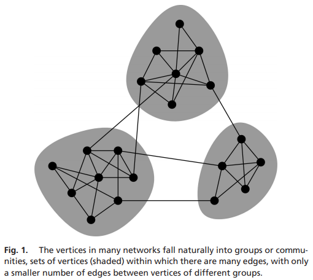

# Implementation of Newman's spectral methods to maximize modularity.

## :page_with_curl: General description
Implementation of algorithm for cluster detection within networks. The method is useful in various fields to characterize functional clusters of individual nodes within a system. (see reference below)

  

> **_Reference:_**
Newman, Mark EJ. "Modularity and community structure in networks." Proceedings of the national academy of sciences 103, no. 23 (2006): 8577-8582. [[Link]](https://www.pnas.org/content/103/23/8577.short)

 

## :inbox_tray: Input 
The algorithm recieves a file representing the graph.
The first value represents the number of nodes in the network. The second represents the number of edges of the first node, i.e., k1. It is followed by the k1 indices of its neighbors, in increasing order. The next value is k2, followed by the k2 indices of the neighbors of the second node, and so on up to node n.

## :outbox_tray: Output
The algorithm creates an output file describing the clusters within the graph.
The first value represents the total number of identified clusters. The second represents the number of nodes in the first cluster, followed by the indices of these nodes, in increasing order. The next value is the number of nodes in the second cluster, followed by their indices, and so on up to the last cluster.

## :arrow_forward: Execution Instructions:
The program is compiled using the command: 

    make
Then, to run the program use the command: 

    ./cluster input_file.in output_file.out
This will create a new file named 'output_file.out' containing the output.

